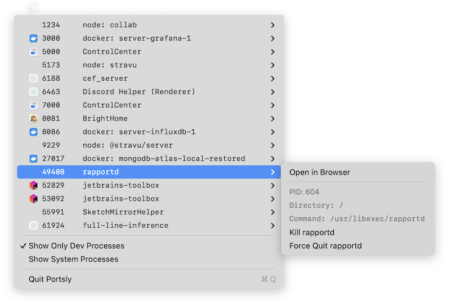

# Portsly

A lightweight macOS menu bar app that shows which applications are listening on which ports, with a quick way to kill them.



## Features

- View all listening TCP ports and their processes at a glance
- View PIDs, commands and working directories
- Quick "Open in Browser" for web services
- Kill processes with one click (with confirmation)
- Smart name detection for NodeJS apps, Docker, Python and other dev tools
- Filters for dev processes and system process
- Toggleable filters out system processes by default

## Usage

1. Click the Portsly icon in your menu bar
2. View all processes listening on TCP ports
3. Click on any port to see options:
- **Open in Browser**: Opens `http://localhost:PORT` in your default browser
- **Kill Process**: Sends SIGTERM to the process
- **Force Quit**: Sends SIGKILL to the process

## Installation

### From Release
1. Download the latest release from the [Releases](https://github.com/ghinkle/portsly/releases) page
2. Move Portsly.app to your Applications folder
3. Launch Portsly

### Build from Source
Requirements:
- macOS 12.0+
- Xcode 14+
- [XcodeGen](https://github.com/yonaskolb/XcodeGen)

```bash
# Clone the repository
git clone https://github.com/ghinkle/portsly.git
cd portsly

# Quick build
./build.sh

# Or manually:
xcodegen generate
open Portsly.xcodeproj
# Then build and run in Xcode (⌘+R)
```

## 

## Privacy & Security

Portsly runs shell commands to load network ports and command information. There is no telemetry. This is just a simple, free utility.


## Contributing

Contributions are welcome! Please feel free to submit a Pull Request.

## License

This project is licensed under the MIT License - see the [LICENSE](LICENSE) file for details.

## Acknowledgments

- Uses XcodeGen for project generation
- Built with Swift and SwiftUI